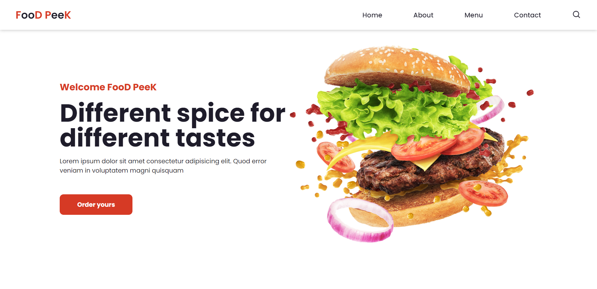
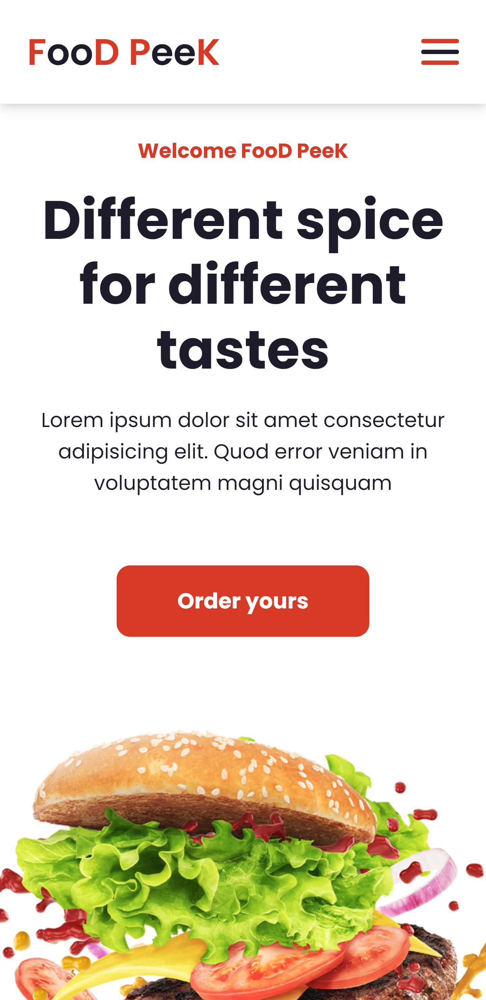
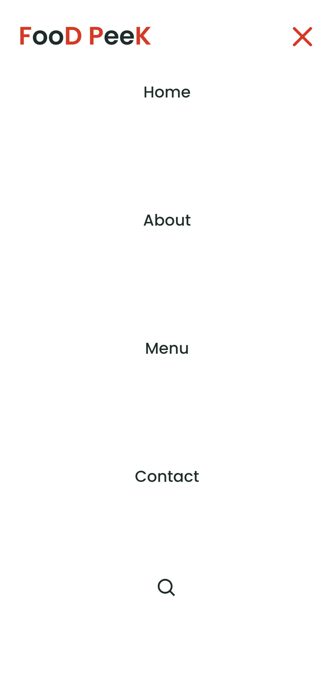

# Landing page "Food Peek"
A idéia desse projeto é construir uma landing page simples, porém responsiva com HTML, CSS e JavaScript (Puro).

## O resultado:

  
   

Links úteis:
- [Criando Landing Page Responsiva do Zero || Html, Css e JavaScript](https://www.youtube.com/watch?v=G8rUCF3BY6s&ab_channel=DEVenvolvente)
- [GitHub do Criador do Projeto](https://github.com/DevEnvolvente0190/LandingPage-Responsiva)