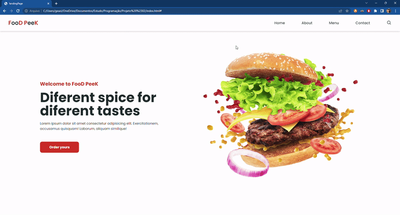

# projetos repo
Nesse repositório você irá encontrar alguns projetos feitos em diversas linguagens de programação.

# Projetos em destaque:

📌 [Projeto #03 - Meu portfólio](#projeto-03---meu-portifólio)

📌 [Projeto #02 - Landing Page Food Peek](#projeto-02---landing-page-food-peek)

## Projeto #01 - Jogo da Cobrinha
Esse projeto é um estudo da biblioteca *pygame*, em que eu montei o classico jogo da cobrinha:

## Projeto #02 - Landing Page Food Peek
Esse projeto é um estudo de HTML5, CSS3 e JavaScript. Que teve como objetivo fazer uma landing page responsiva.

Links úteis:
- [Criando Landing Page Responsiva do Zero || Html, Css e JavaScript](https://www.youtube.com/watch?v=G8rUCF3BY6s&ab_channel=DEVenvolvente)
- [GitHub do Criador do Projeto](https://github.com/DevEnvolvente0190/LandingPage-Responsiva)

## Projeto #03 - Meu portifólio
O meu portifólio ainda está em desenvolvimento, mas em breve será adicionado alguns detalhes sobre o projeto aqui.

## Projeto #04 - Player de Música
Esse projeto é de uma série de desafios promovidos pela Rocketseat chamado #boraCodar.
O primeiro projeto é um player de música

## Projeto #05 - Jogo SIMPLES do Mário com HTML, CSS e JS puro.
Esse projeto é um pequeno estudo de HTML, CSS e Javascript puro, com bastante comentários (não reparem tanto, é só pra estudo).
Esse projeto consiste em montar um jogo que é uma mistura de Super Mário e Flappy Bird utilizando os conceitos de:
- [Conceitos do HTML]
- [Conceitos do CSS]
- [Conceitos do Javascript]

Links Úteis:
- [Como criar um jogo SIMPLES usando JavaScript e HTML | JavaScript para iniciantes - Tutorial](https://youtu.be/r9buAwVBDhA)
- [GitHub do Criador do Projeto](https://github.com/manualdodev)