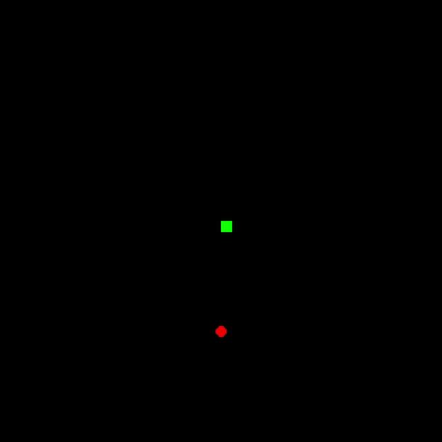
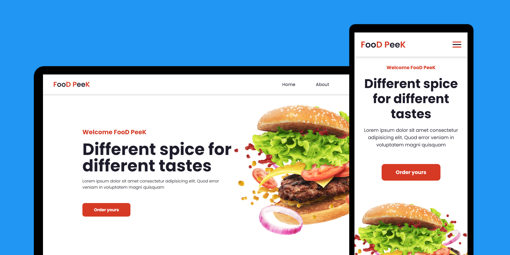
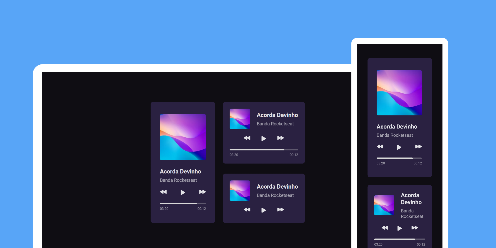
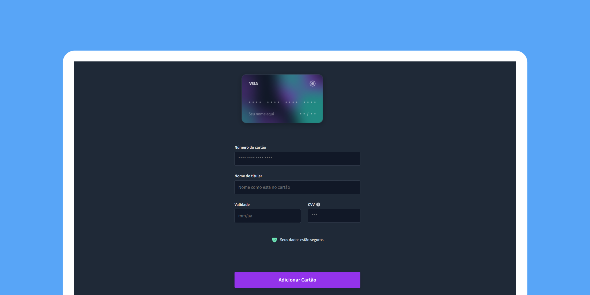

# projetos repo

Nesse repositório você irá encontrar alguns projetos feitos em diversas linguagens de programação.

 

### Destaques

📌 [Projeto #04 - Um player de música](#projeto-04)

📌 [Projeto #06 - Formulário de Cartão de Crédito](#projeto-06)

 
 

<table>
    <thead>
        <tr>
            <th align="center">
                 
                

                    <small>#</small>
                

            </th>
            <th align="center">
                 
                
 
                    <small>
                        NOME/DESCRIÇÃO
                    </small>
                

            </th>
          <th align="center">
                 
                
 
                    <small>
                        LINGUAGEM,  
                        BIBLIOTECA ou  
                        FRAMEWORK
                    </small>
                

            </th>
            <th align="center">
                
                
 
                    <small>
                    PREVIEW
                    </small>
                

            </th>
        </tr>
    </thead>
    <tbody>
        <tr>
            <td id="projeto-01">01</td>
            <td>
              <h3>Jogo da Cobrinha</h3>
              
O classico jogo da cobrinha, feito em Python, com a biblioteca <em>pygame</em>, somente para estudo.

            </td>
            <td>
              
Pyhton, <em>pygame</em>

            </td>
            <td align="center">
              
            </td>
        </tr>
        <tr>
            <td id="projeto-02">02</td>
            <td>
              <h3>Landing Page Food Peek</h3>
              
Uma landing page responsiva, com side-bar mobile.

              
Links úteis:

              <a href="https://www.youtube.com/watch?v=G8rUCF3BY6s&ab_channel=DEVenvolvente">
                
Vídeo do Projeto

              </a>
              <a href="https://github.com/DevEnvolvente0190/LandingPage-Responsiva">
                
GitHub do Criador do Projeto

              </a>
            </td>
            <td>
              
HTML, CSS e Javascript puro

            </td>
            <td align="center">
              
            </td>
        </tr>
        <tr>
            <td id="projeto-03">03</td>
            <td>
              <h3>Meu portifólio</h3>
              
O meu portifólio ainda está em desenvolvimento, mas em breve será adicionado alguns detalhes sobre o projeto aqui.

            </td>
            <td>
              

            </td>
            <td align="center">
              
            </td>
        </tr>
        <tr>
            <td id="projeto-04">04</td>
            <td>
              <h3>Player de Música</h3>
              
Esse projeto é de uma série de desafios promovidos pela Rocketseat chamado #boraCodar.

              
O primeiro projeto dessa série é um player de música responsivo, que no caso, se trata desse projeto.

            </td>
            <td>
              
HTML e CSS puros

            </td>
            <td align="center">
             
            </td>
        </tr>
        <tr>
            <td id="projeto-05">05</td>
            <td>
              <h3>Jogo simples do Mário</h3>
              
Esse projeto consiste em montar um jogo que é uma mistura de Super Mário e Flappy Bird.

              
Links úteis:

              <a href="https://youtu.be/r9buAwVBDhA">
                
Vídeo do Projeto

              </a>
              <a href="https://github.com/manualdodev">
                
GitHub do Criador do Projeto

              </a>
            </td>
            <td>
              
HTML, CSS e Javascript puro

            </td>
            <td align="center">
             
            </td>
        <tr>
            <td id="projeto-06">06</td>
            <td>
              <h3>Formulário de Cartão de Crédito</h3>
              
Tal projeto se trata de uma série de desafios semanais promovidos pela Rocketseat, chamado #boraCodar.

              
Esse é o vigésimo primeiro desafio dessa série, e se trata de um <strong>Formulário de Cartão de Crédito com efeito de "flip" no cartão</strong>.

            </td>
            <td>
              HTML e CSS puros
            </td>
            <td align="center" >
              
            </td>
        </tr>
    </tbody>
</table>     